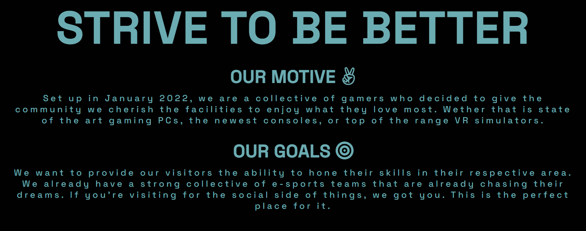
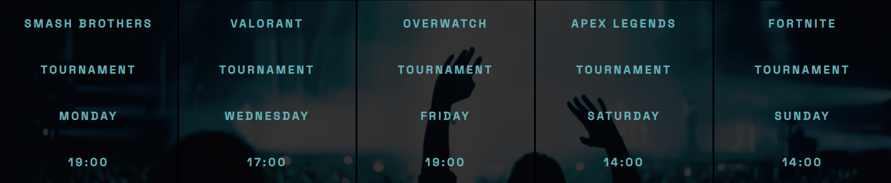
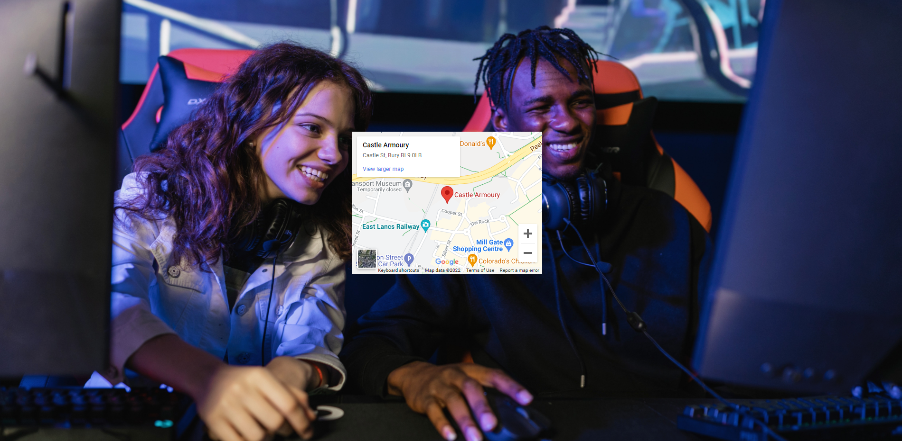
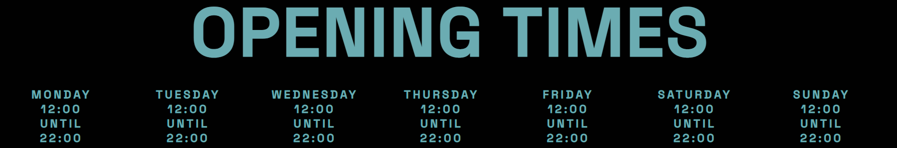
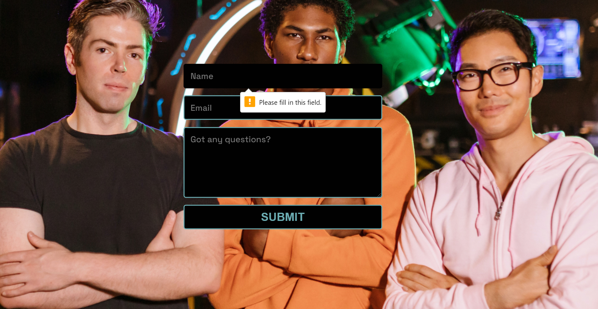

# Silver Street

The Silver Street website is a landing page for adults and children interested in all aspects of gaming, in and around the Greater Manchester area. It offers various fun activites and events for any age group.

Visitors to the website are greeted with all the information they need to know about Silver Street: About the venue, a gallery, pricing, opening times, location and contact information.

[Link to the live site](https://jrdnbrkfld.github.io/pp1-silver-street/index.html)

# Features

## Navigation

- Featured at the top of the website on all 4 pages.
- To the left it displays the Silver Street logo and name, which also acts as a link to return to the home page.
- To the right it displays all the navigation links. These being Home, Gallery, Visit & Contact Us.
- This feature allows the user to intuitively navigate to any section of the website that they need.

## Hero Image

- The hero image is in keeping with the idea of a gaming venue, showing a man invested in the game he is playing.
- Cover text is included, rested on top of the hero image giving a quick idea of the success of the venue. It contrasts well with the image in the background.
- An animation is also used on the hero image, causing it to zoom out when first loaded. The code used is shown below.

## About Us

- Features a tagline of Strive to be better, showing the visitor that the goal of the website is to promote positivity and bettering yourself.
- The motive section gives a brief history about the venue and the kind of tech they have available.
- The goals section informs the visitor of the main idea of the venue, and what they aim to achieve.

## Events

- Gives the visitor a list of the kind of events that are staged at the venue.
- It shows the game played, day it is taking place and the time it begins.
- The transparency of the background image had to be adjusted to contrast well with the font color.

## Gallery

- Contains 8 images from inside the venue, displayed in a masonry style.

## Visit Us

- Features a background image of a man and a woman playing a game.
- A map from Google Maps has been embedded on top of the background image.
- This allows the user to plan their visit accordingly, checking for public transport links and parking.

- At the bottom of the page it also includes the opening/closing times and days they are open.

## Contact Us

- Features a background image of one of the teams that frequent Silver Street.
- This section has a form included that visitors of the webpage can fill out if they require more information.
- All 3 of the fields are marked as required before anything can be submitted.

## Social Media Links

- A total of 5 images to find Silver Street on Facebook, Twitter, Instagram, Youtube and Twitch.
- When clicked they will open a new tab for the visitor.
- These appear on every page of the website.

 