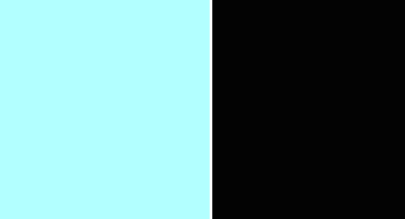

## Table of Contents
* [Purpose](#Purpose)
* [User Experience Design (UX)](#User-Experience-Design)
    * [User stories](#User-Stories)
        * [First Time Visitor Goals](#First-Time-Visitor-Goals)
        * [Returning Visitor Goals](#Returning-Visitor-Goals)
        * [Frequent User Goals](#Frequent-User-Goals)
    * [Design](#Design)
        * [Colour Scheme](#Colour-Scheme)
        * [Typography](#Typography)
        * [Imagery](#Imagery)
- [Features](#Features)
    * [Existing Features](#Existing-Features)

# Milestone Project 1 - Silver Street
## Purpose
This fictional website was created to complete the first Milestone Project for Code Institute's Full Stack Software Developer course.
I built this from the ground up using knowledge I gained from the previous modules. These being HTML, CSS and User Centric Design. The full list of technologies used can be found in the technologies section further down.

You can find the link to the live website right [here](https://jrdnbrkfld.github.io/pp1-silver-street/).

## Silver Street Responsive Website

This fictional website was created to spread awareness for the venue. The website can be used to promote and advertise all of the venues activities and events that are taking place. This would increase sales and public knowledge.

*** 
## User Experience Design

### User stories
#### First Time Visitor Goals
* As a First Time user, I want to easily understand the main purpose of the site and learn more about the venue.
* As a First Time user, I want to be able to easily navigate throughout the site to find content.
* As a First Time user, I want to view the website and content clearly on any device.
* As a First Time user, I want to find ways to follow Silver Street on different social media platforms.
#### Returning Visitor Goals
* As a Returning user, I want to contact the venue so I can request more information.
#### Frequent Visitor Goals
* As a Frequent user, I want to check to see if there are any new upcoming events.
* As a Frequent user, I want to check to see if there are any changes to the opening times and days.

## Design
#### Imagery
The initial images you are greeted to when entering the website are all related to the venues main attractions. These images placements and sizes vary depending on the screen size they are viewed on.
#### Fonts
The font used throughout the website is **Space Grotesk**. I used only 1 font for the site, but used text-transform to make the headers uppercase and paragraphs lowercase.
#### Color Scheme
Two colors are used in this website, these being #010101 and #6bacb2. I found the #6bacb2 color while I was trying to create a logo for the venue, which I didn't actually use in the end product.

## Features

### Existing Features
* Navigation Bar
    * Featured on all 4 pages, the fully responsive navigation bar includes links to the Logo, Home page, Galley, Visit us and Contact us page and is identical across all pages allowing for easy navigation.
    * This section allows visitors to the website to easily navigate from page to page on all devices without having to revert back to the previous page using the 'back' button.
    
    

